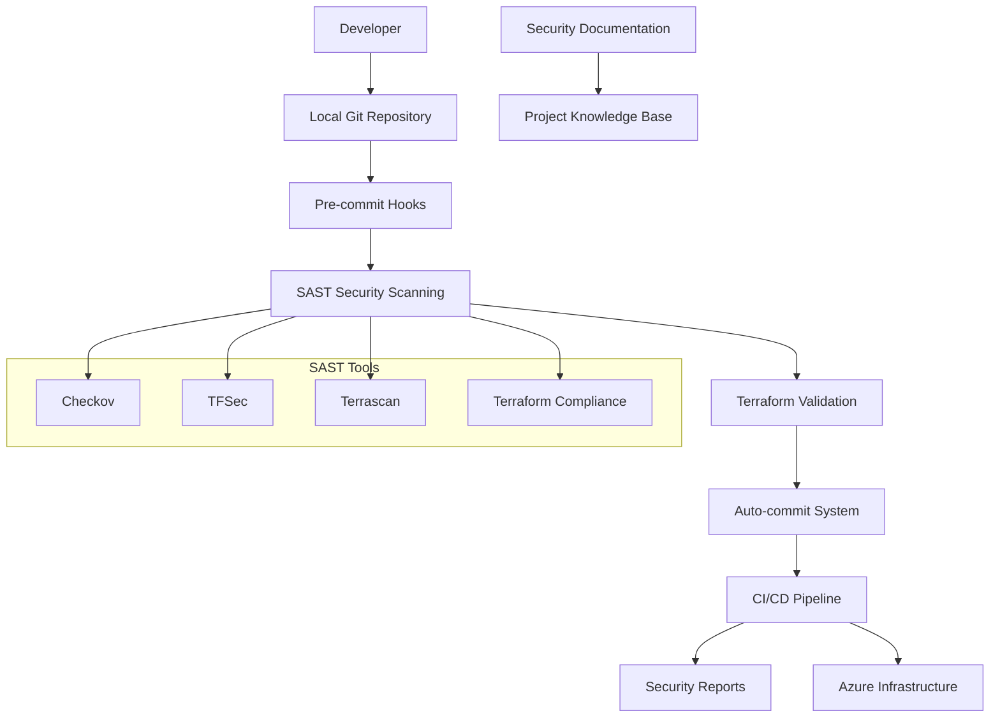
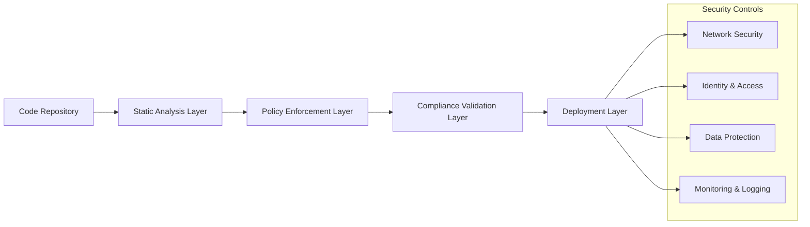

# Design Document

## Overview

This design document outlines the implementation of security enhancements for the Azure Terraform infrastructure project. The solution integrates multiple SAST tools, establishes automated git workflows, implements security best practices, and creates comprehensive documentation systems. The design focuses on creating a secure, maintainable, and well-documented infrastructure-as-code project.

## Architecture

### High-Level Architecture



### Security Layer Architecture



## Components and Interfaces

### 1. Git Repository Management System

**Purpose**: Initialize and manage local git repository with automated commit workflows

**Components**:
- Git initialization script
- .gitignore configuration for Terraform projects
- Auto-commit automation system
- Commit message standardization

**Interfaces**:
- Command-line interface for manual operations
- Automated hooks for task completion events
- Integration with task execution system

### 2. SAST Integration Framework

**Purpose**: Integrate multiple security scanning tools into the development workflow

**Components**:
- **Checkov**: Infrastructure-as-code security scanner
  - Configuration: Custom policies for Azure resources
  - Output: JSON/SARIF format reports
  - Integration: Pre-commit hooks and CI/CD pipelines

- **TFSec**: Terraform-specific security scanner
  - Configuration: Custom rules for Azure best practices
  - Output: JSON/JUnit format reports
  - Integration: Local development and CI/CD

- **Terrascan**: Policy-as-code security validation
  - Configuration: OPA (Open Policy Agent) policies
  - Output: JSON/XML format reports
  - Integration: Compliance validation workflows

- **Terraform Compliance**: BDD-style security testing
  - Configuration: Feature files for security requirements
  - Output: Cucumber-style reports
  - Integration: Acceptance testing workflows

**Interfaces**:
- Unified configuration management
- Standardized report aggregation
- CI/CD pipeline integration APIs
- Local development tool integration

### 3. Security Enhancement Module

**Purpose**: Implement Terraform security best practices across all Azure resources

**Components**:
- **Network Security Enhancements**:
  - NSG rule optimization with least privilege
  - Private endpoint implementations
  - Network segmentation improvements
  - Firewall rule standardization

- **Identity and Access Management**:
  - RBAC assignment optimization
  - Managed identity implementations
  - Key Vault access policy improvements
  - Service principal security hardening

- **Data Protection**:
  - Storage account encryption enhancements
  - Key Vault secret management improvements
  - Database encryption configurations
  - Backup and recovery security

- **Monitoring and Compliance**:
  - Azure Security Center integration
  - Log Analytics workspace optimization
  - Diagnostic settings standardization
  - Compliance policy implementations

**Interfaces**:
- Terraform module interfaces
- Azure Resource Manager APIs
- Security policy enforcement points
- Monitoring and alerting systems

### 4. CI/CD Pipeline Integration

**Purpose**: Automate security scanning and validation in deployment workflows

**Components**:
- **GitHub Actions Workflows**:
  - Security scanning pipeline
  - Terraform validation workflow
  - Deployment automation
  - Report generation and publishing

- **Azure DevOps Pipelines**:
  - Build pipeline with security gates
  - Release pipeline with approval processes
  - Security scan result integration
  - Artifact management

- **Local Development Scripts**:
  - Pre-commit hook implementations
  - Local security scan execution
  - Development environment setup
  - Testing and validation scripts

**Interfaces**:
- Git hook system integration
- CI/CD platform APIs
- Security tool command-line interfaces
- Report aggregation and publishing systems

### 5. Documentation and Knowledge Management

**Purpose**: Maintain comprehensive documentation of security improvements and project changes

**Components**:
- **Security Documentation System**:
  - Security improvement tracking
  - Best practices documentation
  - Compliance requirement mapping
  - Risk assessment documentation

- **Change Management Documentation**:
  - Automated changelog generation
  - Task completion tracking
  - Version control integration
  - Impact analysis documentation

- **Operational Documentation**:
  - Setup and configuration guides
  - Troubleshooting documentation
  - Maintenance procedures
  - Security incident response procedures

**Interfaces**:
- Markdown-based documentation system
- Git integration for version control
- Automated documentation generation
- Search and navigation capabilities

## Data Models

### Security Scan Result Model

```json
{
  "scanId": "string",
  "timestamp": "ISO8601",
  "tool": "checkov|tfsec|terrascan|terraform-compliance",
  "status": "passed|failed|warning",
  "results": [
    {
      "ruleId": "string",
      "severity": "critical|high|medium|low|info",
      "resource": "string",
      "file": "string",
      "line": "number",
      "description": "string",
      "remediation": "string"
    }
  ],
  "summary": {
    "totalChecks": "number",
    "passed": "number",
    "failed": "number",
    "warnings": "number"
  }
}
```

### Git Commit Model

```json
{
  "commitId": "string",
  "timestamp": "ISO8601",
  "taskId": "string",
  "taskName": "string",
  "changes": [
    {
      "file": "string",
      "action": "added|modified|deleted",
      "linesChanged": "number"
    }
  ],
  "message": "string",
  "author": "string"
}
```

### Security Configuration Model

```json
{
  "configId": "string",
  "resource": "string",
  "securityControls": [
    {
      "controlId": "string",
      "name": "string",
      "status": "implemented|pending|not_applicable",
      "configuration": "object",
      "compliance": [
        {
          "framework": "string",
          "requirement": "string",
          "status": "compliant|non_compliant"
        }
      ]
    }
  ]
}
```

## Error Handling

### Security Scan Failures

- **Critical/High Severity Issues**: Block deployment, require manual review
- **Medium Severity Issues**: Generate warnings, allow deployment with approval
- **Low/Info Severity Issues**: Log for review, allow automatic deployment

### Git Operation Failures

- **Commit Failures**: Retry with exponential backoff, fallback to manual intervention
- **Repository Initialization Failures**: Provide detailed error messages and remediation steps
- **Merge Conflicts**: Halt automation, require manual resolution

### CI/CD Pipeline Failures

- **Tool Installation Failures**: Provide alternative installation methods
- **Configuration Errors**: Validate configurations before execution
- **Network/Connectivity Issues**: Implement retry mechanisms with circuit breakers

### Documentation Generation Failures

- **Template Errors**: Fallback to basic documentation templates
- **File System Errors**: Implement proper error logging and recovery
- **Content Validation Errors**: Provide clear validation error messages

## Testing Strategy

### Unit Testing

- **SAST Tool Integration**: Test individual tool configurations and outputs
- **Git Operations**: Test repository initialization and commit automation
- **Security Configurations**: Validate Terraform security implementations
- **Documentation Generation**: Test template rendering and content validation

### Integration Testing

- **End-to-End Workflows**: Test complete security scanning and deployment workflows
- **CI/CD Pipeline Integration**: Validate pipeline execution with security gates
- **Multi-tool Coordination**: Test interaction between different SAST tools
- **Documentation System Integration**: Test automated documentation updates

### Security Testing

- **Vulnerability Scanning**: Regular scans of the tooling infrastructure
- **Configuration Validation**: Test security configurations against compliance frameworks
- **Access Control Testing**: Validate RBAC implementations and permissions
- **Data Protection Testing**: Test encryption and secret management implementations

### Performance Testing

- **Scan Execution Time**: Optimize SAST tool execution for reasonable build times
- **Resource Utilization**: Monitor CI/CD resource consumption
- **Scalability Testing**: Test with large Terraform codebases
- **Parallel Execution**: Optimize concurrent security scan execution

### Compliance Testing

- **Policy Validation**: Test against industry security frameworks (CIS, NIST)
- **Regulatory Compliance**: Validate against relevant compliance requirements
- **Audit Trail Testing**: Ensure proper logging and documentation for audits
- **Change Management Testing**: Validate change tracking and approval processes