# Architecture Documentation - Terraform Security Enhancement

## Overview

The Terraform Security Enhancement project implements a comprehensive, integrated security framework that seamlessly combines infrastructure-as-code best practices with automated security validation, intelligent workflow automation, and continuous integration/deployment pipelines.

## System Architecture

### High-Level Architecture

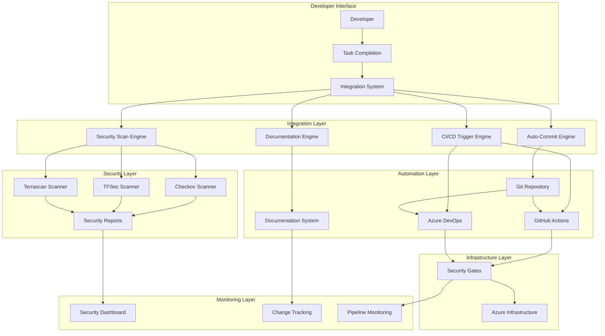

## Component Architecture

### 1. Integration System Core

#### Master Integration Controller
**Location**: `scripts/integration/master-integration.ps1`

**Responsibilities**:
- Orchestrates all integration workflows
- Provides unified interface for system operations
- Manages component lifecycle and dependencies
- Handles error recovery and rollback scenarios

**Key Functions**:
```powershell
# Primary entry points
-Action setup           # Initialize system components
-Action validate        # Validate system configuration
-Action task-complete   # Execute task completion workflow
-Action security-scan   # Run security validation
-Action status          # Display system health
```

#### Integration Orchestrator
**Location**: `scripts/integration/integration-orchestrator.ps1`

**Responsibilities**:
- Coordinates individual integration components
- Manages workflow execution order
- Handles inter-component communication
- Provides granular control over integration processes

**Architecture Pattern**: Command Pattern with Strategy Selection

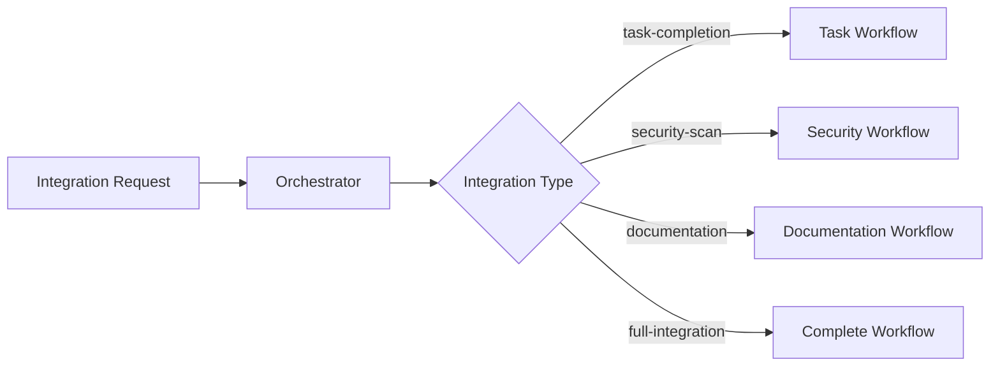

### 2. Auto-Commit System

#### Architecture Pattern: Template Method with Strategy

**Components**:
- **Auto-Commit Engine**: Core commit logic
- **Task Detection**: Intelligent task type identification
- **Message Generation**: Standardized commit message creation
- **Validation**: Pre-commit validation and checks

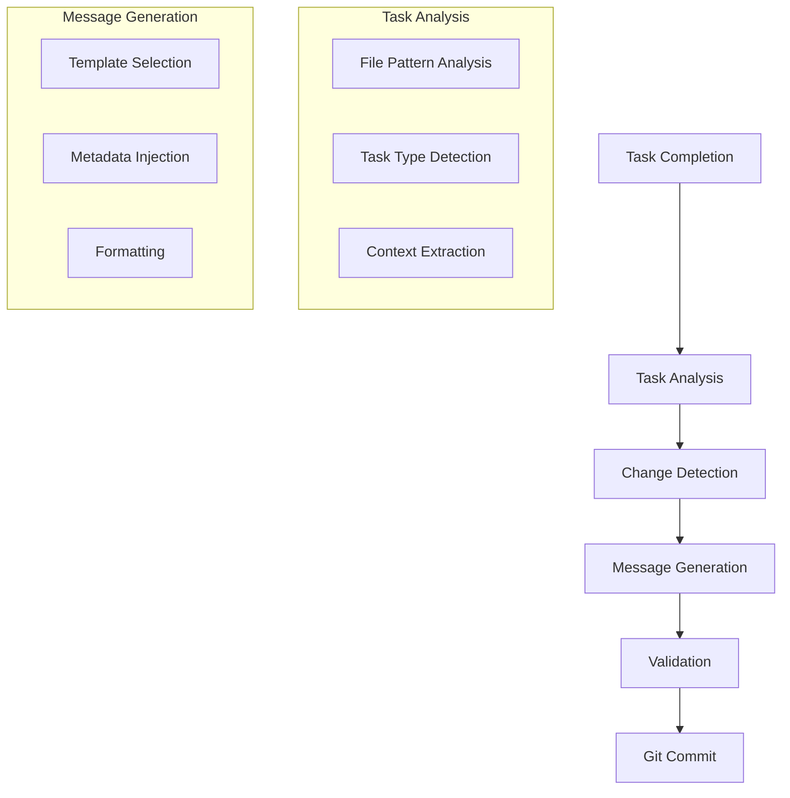

#### Commit Message Standards

**Format**: `{type}({scope}): {description}`

**Types**:
- `feat`: New features or enhancements
- `security`: Security-related changes
- `fix`: Bug fixes and corrections
- `docs`: Documentation updates
- `ci`: CI/CD pipeline changes
- `refactor`: Code refactoring
- `test`: Test additions or modifications

### 3. Security Scanning Engine

#### Multi-Tool Integration Architecture

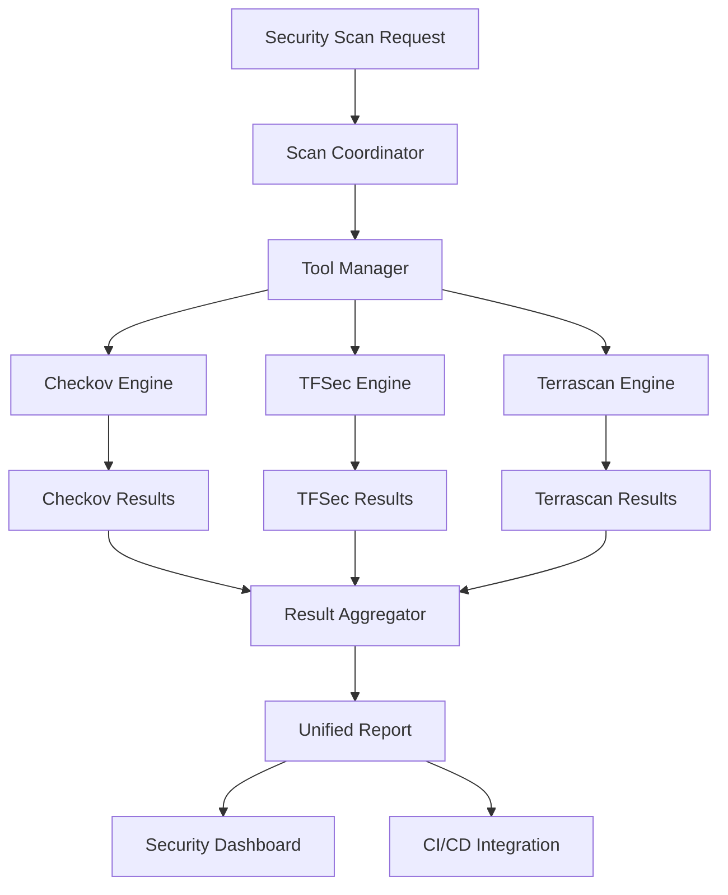

#### Security Tool Configuration

**Checkov Configuration** (`security/sast-tools/.checkov.yaml`):
- Infrastructure security scanning
- Custom policy definitions
- Azure-specific rule sets
- Compliance framework mapping

**TFSec Configuration** (`security/sast-tools/.tfsec.yml`):
- Terraform-specific security analysis
- Custom rule definitions
- Severity level configuration
- Output format specifications

**Terrascan Configuration** (`security/sast-tools/.terrascan_config.toml`):
- Policy-as-code validation
- OPA (Open Policy Agent) integration
- Custom policy development
- Compliance reporting

### 4. Documentation System

#### Intelligent Documentation Engine

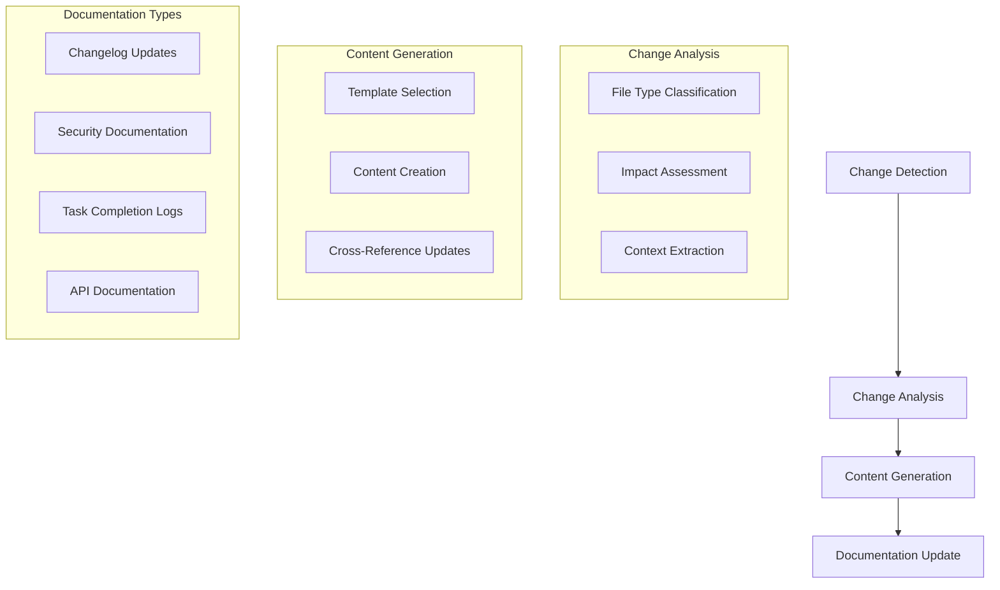

#### Documentation Automation Features

**Automatic Updates**:
- **Changelog Generation**: Git history analysis and categorization
- **Security Documentation**: Scan result integration and trend analysis
- **Task Tracking**: Completion logging and progress monitoring
- **Cross-References**: Automatic link updates and validation

### 5. CI/CD Integration Layer

#### Pipeline Architecture

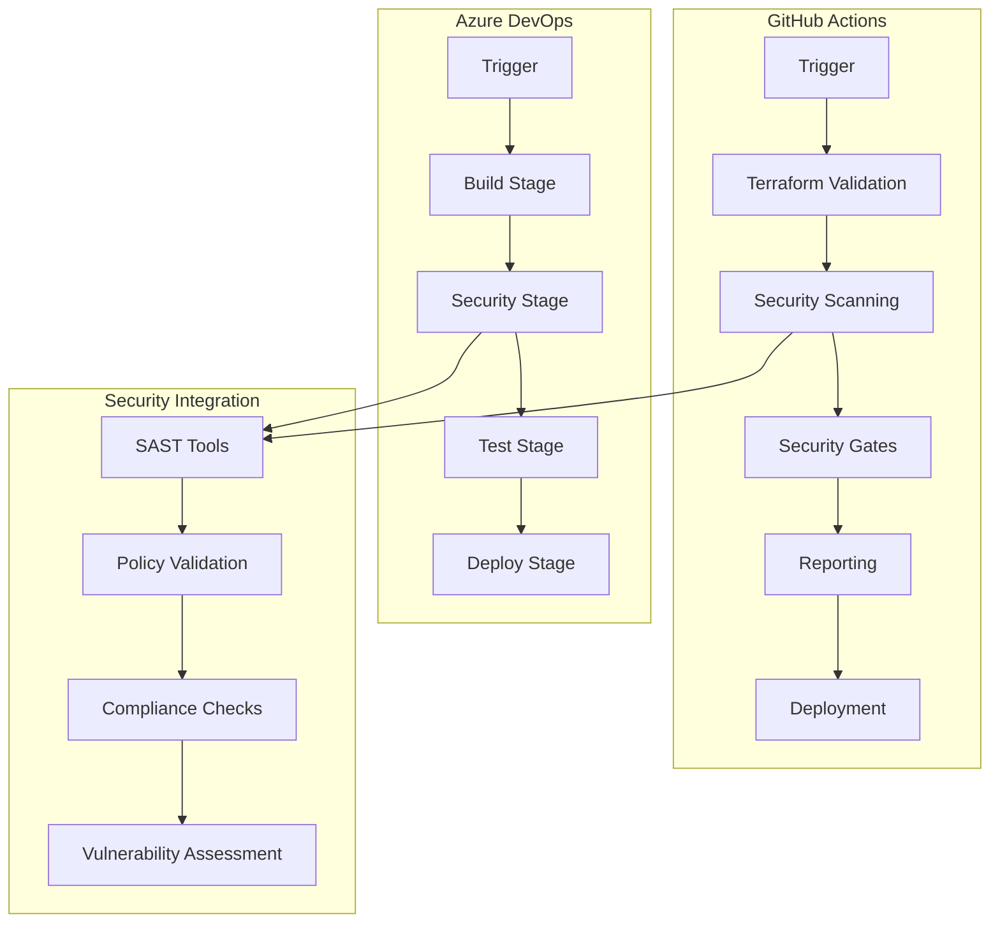

#### Security Gates Implementation

**Gate Types**:
1. **Critical Security Gate**: Blocks on critical severity issues
2. **High Security Gate**: Blocks on high severity issues (configurable)
3. **Compliance Gate**: Validates against compliance frameworks
4. **Policy Gate**: Enforces organizational policies

**Gate Configuration**:
```yaml
security_gates:
  critical_threshold: 0    # No critical issues allowed
  high_threshold: 0        # No high issues allowed (configurable)
  compliance_required: true
  policy_enforcement: strict
```

## Data Flow Architecture

### Task Completion Flow

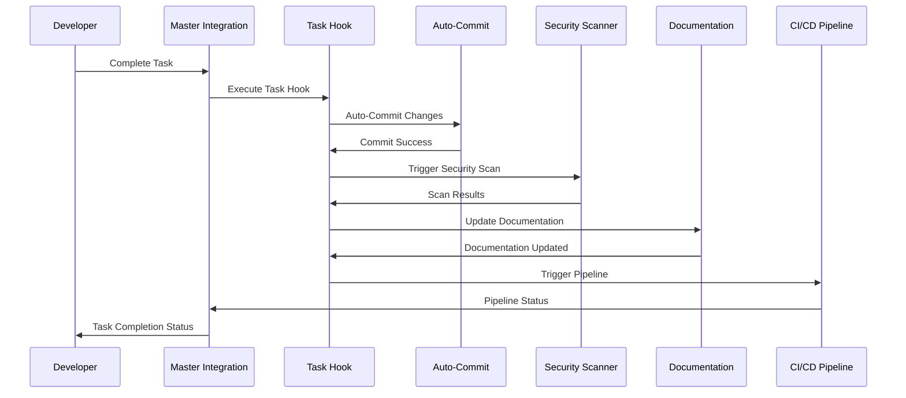

### Security Validation Flow

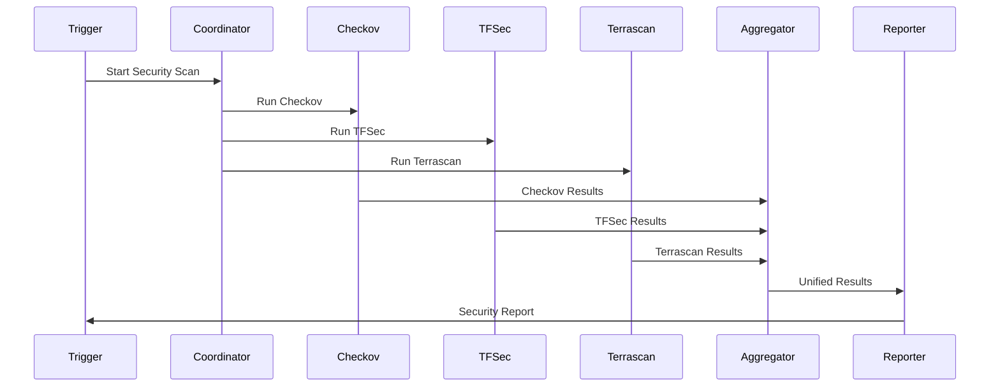

## Security Architecture

### Defense in Depth Strategy

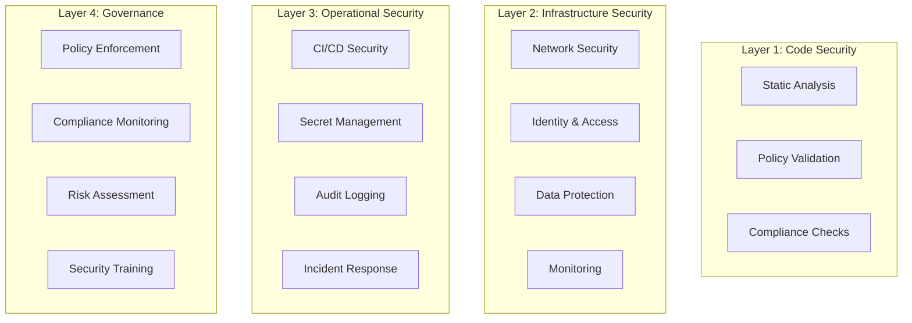

### Security Control Implementation

**Network Security**:
- Network Security Groups (NSGs) with least privilege
- Private endpoints for sensitive services
- Network segmentation and micro-segmentation
- DDoS protection and monitoring

**Identity and Access Management**:
- Azure Active Directory integration
- Role-Based Access Control (RBAC)
- Managed identities for Azure resources
- Conditional access policies

**Data Protection**:
- Encryption at rest and in transit
- Key management with Azure Key Vault
- Data classification and labeling
- Backup and disaster recovery

## Scalability Architecture

### Horizontal Scaling

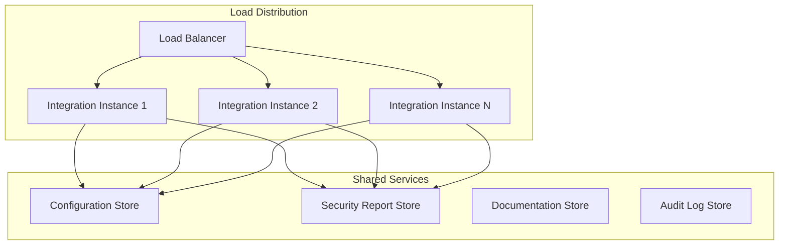

### Performance Optimization

**Caching Strategy**:
- Security scan result caching
- Configuration caching
- Template caching for documentation
- Pipeline artifact caching

**Parallel Processing**:
- Concurrent SAST tool execution
- Parallel documentation updates
- Asynchronous CI/CD triggers
- Background report generation

## Monitoring and Observability

### Monitoring Architecture

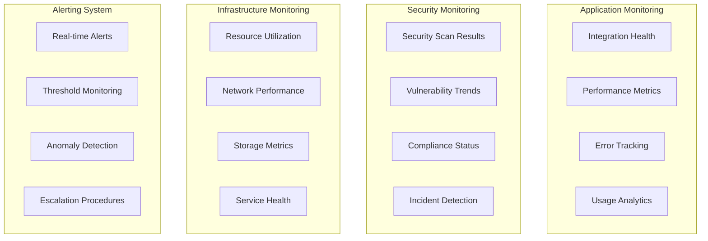

### Key Performance Indicators (KPIs)

**Integration Performance**:
- Task completion success rate
- Average integration execution time
- Error rate and recovery time
- System availability

**Security Metrics**:
- Security scan coverage
- Vulnerability detection rate
- Mean time to remediation
- Compliance score trends

## Disaster Recovery Architecture

### Backup Strategy

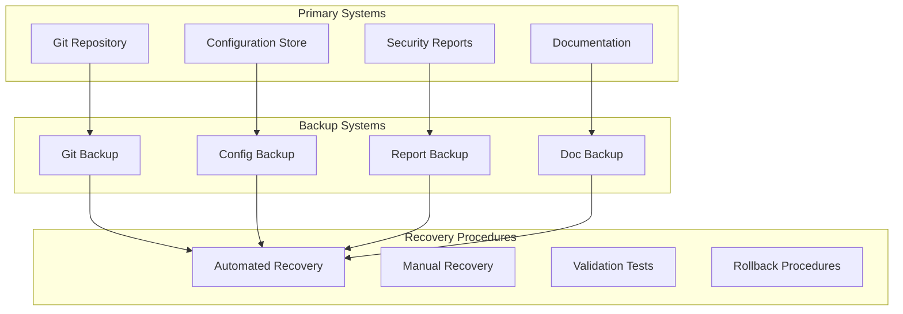

### Recovery Time Objectives (RTO)

| Component | RTO | RPO | Recovery Method |
|-----------|-----|-----|-----------------|
| Integration System | 15 minutes | 5 minutes | Automated failover |
| Security Scanning | 30 minutes | 15 minutes | Service restart |
| Documentation | 1 hour | 30 minutes | Backup restoration |
| CI/CD Pipelines | 5 minutes | 1 minute | Pipeline retry |

## Technology Stack

### Core Technologies

| Layer | Technology | Version | Purpose |
|-------|------------|---------|---------|
| Infrastructure | Terraform | ≥1.5.7 | Infrastructure as Code |
| Cloud Platform | Azure | Latest | Cloud infrastructure |
| Automation | PowerShell | ≥5.1 | Scripting and automation |
| Version Control | Git | Latest | Source code management |

### Security Tools

| Tool | Version | Purpose | Configuration |
|------|---------|---------|---------------|
| Checkov | ≥3.0.0 | Infrastructure security | `.checkov.yaml` |
| TFSec | ≥1.28.0 | Terraform security | `.tfsec.yml` |
| Terrascan | ≥1.18.0 | Policy validation | `.terrascan_config.toml` |

### CI/CD Platforms

| Platform | Features | Configuration |
|----------|----------|---------------|
| GitHub Actions | Workflows, Security, SARIF | `.github/workflows/` |
| Azure DevOps | Pipelines, Gates, Artifacts | `azure-pipelines.yml` |

## Design Patterns

### Integration Patterns

1. **Command Pattern**: Master integration controller
2. **Strategy Pattern**: Task type-specific workflows
3. **Template Method**: Standardized execution flows
4. **Observer Pattern**: Event-driven documentation updates
5. **Factory Pattern**: Security tool instantiation

### Security Patterns

1. **Defense in Depth**: Multiple security layers
2. **Fail Secure**: Secure defaults and failure modes
3. **Least Privilege**: Minimal required permissions
4. **Zero Trust**: Verify everything, trust nothing

### Operational Patterns

1. **Circuit Breaker**: Fault tolerance and recovery
2. **Bulkhead**: Component isolation
3. **Retry**: Transient failure handling
4. **Timeout**: Resource protection

## Future Architecture Considerations

### Planned Enhancements

1. **Microservices Architecture**: Component decomposition
2. **Event-Driven Architecture**: Asynchronous processing
3. **Multi-Cloud Support**: Cloud provider abstraction
4. **AI/ML Integration**: Intelligent security analysis

### Scalability Roadmap

1. **Container Orchestration**: Kubernetes deployment
2. **Service Mesh**: Inter-service communication
3. **API Gateway**: Unified API management
4. **Distributed Caching**: Performance optimization

This architecture provides a solid foundation for secure, scalable, and maintainable infrastructure automation while ensuring comprehensive security validation and operational excellence.