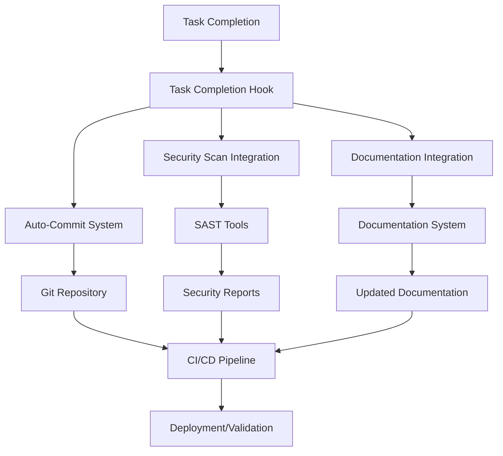

# Integration System Documentation

This directory contains the integration system that connects all components of the Terraform Security Enhancement project, including auto-commit workflows, SAST tools, CI/CD pipelines, and documentation systems.

## Overview

The integration system provides a unified workflow that automatically:
- Commits changes when tasks are completed
- Triggers security scans when relevant code changes
- Updates documentation based on changes and scan results
- Integrates with CI/CD pipelines for automated validation

## Components

### Core Integration Scripts

| Script | Purpose | Usage |
|--------|---------|-------|
| `master-integration.ps1` | Main entry point for all integration workflows | `.\master-integration.ps1 -Action <action>` |
| `integration-orchestrator.ps1` | Coordinates individual integration components | Called by other scripts |
| `task-completion-hook.ps1` | Handles task completion workflows | Triggered on task completion |
| `cicd-integration-config.ps1` | Validates and configures CI/CD integration | `.\cicd-integration-config.ps1 -Platform <platform>` |
| `documentation-integration.ps1` | Manages documentation updates | `.\documentation-integration.ps1 -UpdateTrigger <trigger>` |

### Integration Flow



## Quick Start

### 1. Setup Integration Environment

```powershell
# Initialize all integration components
.\master-integration.ps1 -Action setup

# Validate integration setup
.\master-integration.ps1 -Action validate
```

### 2. Complete a Task with Full Integration

```powershell
# Complete a task with automatic commit, scan, and documentation update
.\master-integration.ps1 -Action task-complete -TaskName "Implement security feature" -TaskId "9.1"

# Complete a task without security scan
.\master-integration.ps1 -Action task-complete -TaskName "Update documentation" -SkipScan
```

### 3. Run Security Scan Integration

```powershell
# Run security scan and update documentation
.\master-integration.ps1 -Action security-scan

# Dry run to see what would happen
.\master-integration.ps1 -Action security-scan -DryRun
```

### 4. Check Integration Status

```powershell
# Show current integration status
.\master-integration.ps1 -Action status

# Show detailed status with verbose output
.\master-integration.ps1 -Action status -Verbose
```

## Integration Workflows

### Task Completion Workflow

When a task is completed, the integration system:

1. **Auto-Commit**: Automatically commits changes with standardized commit messages
2. **Security Scan**: Runs SAST tools if security-related changes are detected
3. **Documentation Update**: Updates relevant documentation based on changes
4. **CI/CD Trigger**: Triggers pipeline validation if configured

```powershell
# Example: Complete a security enhancement task
.\task-completion-hook.ps1 -TaskName "Enhance storage account security" -TaskId "4.1" -TaskType "security"
```

### Security Scan Integration

Integrates SAST tools with the development workflow:

1. **Tool Execution**: Runs Checkov, TFSec, and Terrascan
2. **Report Aggregation**: Combines results into unified reports
3. **Documentation Update**: Updates security documentation with results
4. **CI/CD Integration**: Provides results to pipeline for gates

```powershell
# Run integrated security scan
.\integration-orchestrator.ps1 -IntegrationType security-scan
```

### Documentation Integration

Automatically maintains project documentation:

1. **Change Tracking**: Analyzes git changes and categorizes them
2. **Changelog Updates**: Automatically updates CHANGELOG.md
3. **Security Documentation**: Updates security docs with scan results
4. **Task Logging**: Maintains task completion logs

```powershell
# Update documentation for security scan results
.\documentation-integration.ps1 -UpdateTrigger security-scan
```

## Configuration

### Environment Variables

The integration system respects these environment variables:

- `INTEGRATION_DRY_RUN`: Set to "true" to enable dry run mode by default
- `INTEGRATION_VERBOSE`: Set to "true" to enable verbose output by default
- `SKIP_SECURITY_SCAN`: Set to "true" to skip security scans by default
- `SKIP_DOCUMENTATION`: Set to "true" to skip documentation updates by default

### CI/CD Platform Configuration

#### GitHub Actions

The system integrates with the existing GitHub Actions workflow:
- File: `.github/workflows/terraform-security-scan.yml`
- Triggers: Push, Pull Request, Manual dispatch
- Features: Security scanning, reporting, PR comments

#### Azure DevOps

For Azure DevOps integration:
- File: `azure-pipelines.yml` or `azure-pipelines-security.yml`
- Features: Build validation, security gates, artifact publishing

### Git Hooks Integration

The system can be integrated with git hooks for automatic execution:

```bash
# Install pre-commit hook
.\scripts\git\install-hooks.ps1

# The hook will automatically run integration workflows on commit
```

## Troubleshooting

### Common Issues

#### Integration Scripts Not Found
```
Error: Integration orchestrator not found
```
**Solution**: Run setup to ensure all scripts are in place:
```powershell
.\master-integration.ps1 -Action setup
```

#### Git Repository Not Detected
```
Error: Not in a git repository
```
**Solution**: Ensure you're running from the project root directory with git initialized.

#### Security Scan Failures
```
Security scan integration failed
```
**Solution**: Check that SAST tools are installed and configured:
```powershell
.\security\scripts\install-all-sast-tools.ps1
```

#### CI/CD Integration Issues
```
CI/CD integration needs improvement
```
**Solution**: Validate and fix CI/CD configuration:
```powershell
.\cicd-integration-config.ps1 -Platform both -ValidateOnly
```

### Debug Mode

Enable verbose output for troubleshooting:

```powershell
# Run with verbose output
.\master-integration.ps1 -Action validate -Verbose

# Run with dry run to see what would happen
.\master-integration.ps1 -Action task-complete -TaskName "Test" -DryRun -Verbose
```

### Log Files

Integration logs are stored in:
- `security/reports/integration-status-report.json` - Integration status
- `security/reports/unified-sast-report.json` - Security scan results
- `docs/tasks/task-completion-log.md` - Task completion history

## Advanced Usage

### Custom Task Types

Define custom task types for specialized workflows:

```powershell
# Custom task type with specific integration behavior
.\task-completion-hook.ps1 -TaskName "Custom workflow" -TaskType "terraform" -SkipSecurityScan
```

### Selective Integration

Run only specific parts of the integration:

```powershell
# Only commit, skip scan and docs
.\integration-orchestrator.ps1 -IntegrationType task-completion -SkipScan -SkipDocs

# Only update documentation
.\integration-orchestrator.ps1 -IntegrationType documentation-update
```

### Batch Operations

Process multiple tasks or changes:

```powershell
# Process multiple completed tasks
$tasks = @("Task 1", "Task 2", "Task 3")
foreach ($task in $tasks) {
    .\master-integration.ps1 -Action task-complete -TaskName $task
}
```

## Integration with External Systems

### Webhook Integration

The integration system can be triggered by external webhooks:

```powershell
# Example webhook handler
param($WebhookData)
$taskName = $WebhookData.task_name
$taskId = $WebhookData.task_id

.\master-integration.ps1 -Action task-complete -TaskName $taskName -TaskId $taskId
```

### API Integration

For programmatic access, use the integration scripts with structured output:

```powershell
# Get integration status as JSON
$status = .\master-integration.ps1 -Action status | ConvertTo-Json
```

## Best Practices

1. **Always validate** integration setup before using in production
2. **Use dry run mode** when testing new workflows
3. **Monitor integration logs** for issues and performance
4. **Keep integration scripts updated** with project changes
5. **Test CI/CD integration** regularly to ensure proper functioning
6. **Document custom workflows** for team knowledge sharing

## Support

For issues with the integration system:

1. Check the troubleshooting section above
2. Run validation to identify configuration issues
3. Review integration logs for error details
4. Use verbose mode for detailed debugging information

## Contributing

When modifying the integration system:

1. Test changes with dry run mode first
2. Update documentation for new features
3. Ensure backward compatibility with existing workflows
4. Add appropriate error handling and logging
5. Update the validation scripts for new components